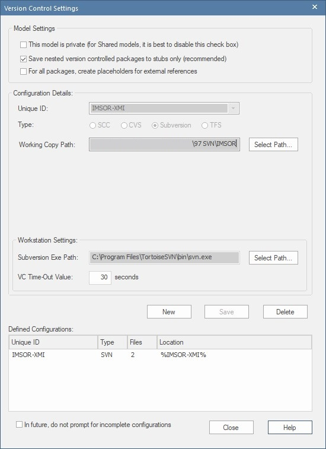
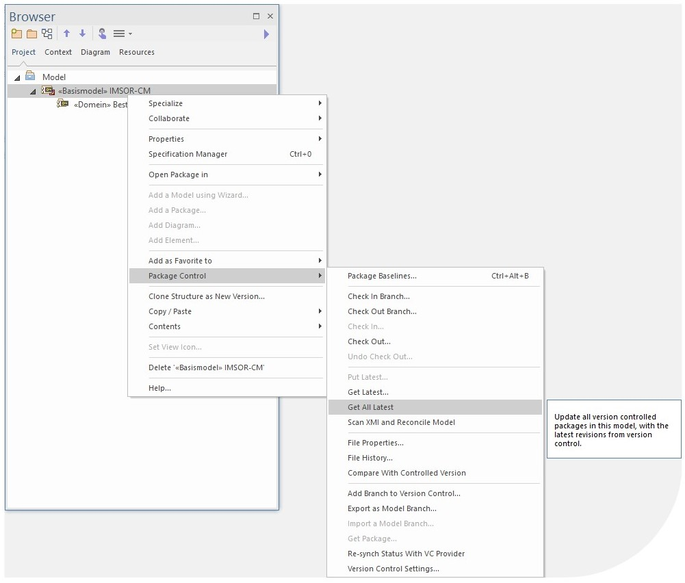

# SVN - Importeren van een bestaand project in EA

Deze handleiding beschrijft hoe je vanuit een nieuw project in Enterprise Architect, de packages van een bestaand project in Subversion, kunt importeren.  

## Voorbereiding

Importeer de MIM-toolbox ([klik hier voor instructie](https://github.com/Geonovum/MIM-Werkomgeving/blob/master/UML%20profieltooling/werkversie1.1.1/README.md#1--importeren-mim-toolbox))

 > **NOTE**: Dit is met name belangrijk als het bestaande project ontwikkeld is met de MIM-toolbox. Door de toolbox eerst te importeren, wordt bij het importeren van de _ automatisch een koppeling gemaakt. 

## _Packages_ importeren

### Stap 1: Configureer de VC-settings
Configueer de version control settings van het bestaande project

 - Ga naar `Configure` > `Project-VC`.
 - Er verschijn nu een venster.
 - Doorloop de volgende onderdelen: 

#### Model Settings:
 - Check: "_Save nested version_" [...]

#### Configuration Details
 - Check: "_Subversion_"
 - Unique ID: selecteer `IMSOR-XMI` (predefined)
 - Selecteer het _Working Copy Path_ dat je gebruikt voor Subversion

#### Workstation Settings
 - Selecteer het _Subversion Exe Path_ (de locatie van het bestand: `svn.exe`).
 - Klik _Save_

#### Defined Configurations
 - Controleer de Defined Configuration. Dit veld heeft nu één ingevulde regel (zie afbeelding)
 - Klik _Close_

## Stap 2: Haal het _package_ op

 - Klik met rechtermuisknop op _Model_ en ga naar `Package Control` > `Get Package`.
 - Selecteer bij _Select a Version Control Configuration_ in: `IMSOR-XMI`.
 - Selecteer bij _Select A Shared File For Inclusion_: `01_CM\version\1.0\basismodel.xml`.

 > **LET OP**: Kies hier het _package_ met het hoogste niveau in de _package_ structuur. Op deze manier haal je ook in één keer alle subpackages op. 

In de _Project Browser_ verschijnt nu het _package_ met het stereotype «basismodel», inclusief de subpackages. Maar, de _packages_ bevatten nog geen inhoud.

## Stap 3: Haal de inhoud van het _package_ op

 - Klik met de rechtermuisknop op het _package_ `«Basismodel»IMSOR-CM`.
 - Klik op 'Ok'
 - Klik met de rechtermuisknop op het _package_ `Basismodel` > `Package Control` > `Get All Latest`.

Er verschijnt een venster
 - Selecteer _Import Changed Files Only_ (recommended)
 - Klik _Ok_.

Het _package_ en de _subpackages_ zijn succesvol geïmporteerd. Indien je meerdere basismodellen (of andere typen _packages_) wilt importeren, doorloop je stap 1 t/m 3 opnieuw.