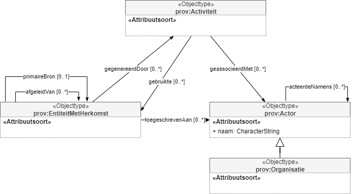
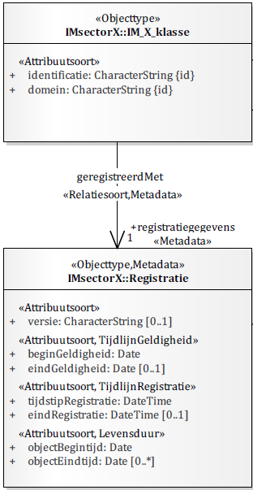
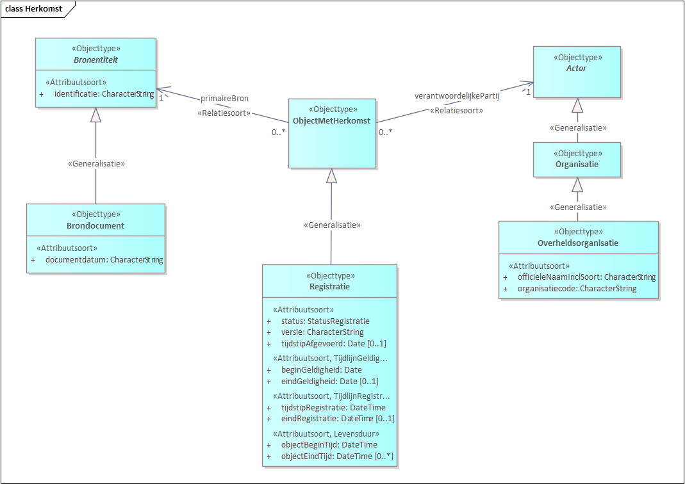

# Metadata

## Metadata op informatieobjectniveau

### Brongegevens van informatieobjecten

Onder herkomstmetadata verstaan we gegevens die beschrijven hoe een informatieobject tot stand is gekomen. Dit wordt ook wel data lineage, of audit trail genoemd.

Er zijn een aantal relevante standaarden op voor het opnemen van metadata op het niveau van informatieobjecten.

* Metagegevens Duurzaam Toegankelijke Overheidsinformatie (MDTO). Dit is een standaard die opgesteld is voor het archiveren van informatieobjecten. Desalniettemin zijn er interessante eigenschappen voor informatieobjecten opgebouwd uit gegevens.
* PROV - internationale W3C standaard voor het beschrijven van herkomst van informatieobjecten.

Het model van PROV-O heeft conceptueel gezien veel gemeen met het MDTO. Zowel PROV als MDTO onderscheiden activiteiten en actoren. Wat in PROV een entiteit wordt genoemd heet in MDTO een record. Het nadeel van MDTO is dat het terminologie gebruikt die toegespitst op de archiefwereld. Zo heet de relatiesoort tussen Record en Actor bijvoorbeeld archiefvormer. Daarnaast biedt het model van PROV nog meer flexibiliteit in het beschrijven van de totstandkoming van informatieobjecten.

Voor dit modelleerpatroon baseren we ons dan ook op de W3C standaardenset PROV, in het bijzonder [[PROV-DM]] en [[PROV-O]].

[[PROV-DM]] beschrijft een standaard informatiemodel om herkomst (provenance) te definiëren, en definieert provenance als:

> provenance is defined as a record that describes the people, institutions, entities, and activities involved in producing, influencing, or delivering a piece of data or a thing.

In dit kader willen we het met name hebben over de herkomst van "a piece of data", ofwel herkomst van informatieobjecten.

Voor het begrip introduceren wij een Nederlandse vertaling van een subset van het PROV model.

<figure id="metadata-herkomst">
  
  <figcaption>Nederlandse vertaling van het W3C PROV model</figcaption>
</figure>

Voor de herkomst van een informatieobject kunnen we een informatieobject als een instantie van een `prov:EntiteitMetHerkomst` beschouwen. De herkomst van een `prov:EntiteitMetHerkomst` kan, zoals eerder genoemd, middels het model vrij uitgebreid beschreven worden. Hierbij kan de afleiding of generatie van een entiteit, de activiteiten die daarbij een rol speelden, en de actoren die handelden of verantwoordelijk zijn, in een keten uitgedrukt worden.

###### Modelleerpatroon voor brongegevens

Een belangrijk doel van herkomst is gegevens herleidbaar kunnen maken naar de bron waarop ze gebaseerd zijn, en naar de actoren die eindverantwoordelijk zijn voor deze gegevens. 

De [[EMSO]] stelt eisen aan de bronverwijzing als metadata van informatieobjecten. Zie de volgende passage uit [[EMSO]]:

> Bronverwijzing betreft aan de ene kant de formele onderbouwing van gegevens, bijvoorbeeld in de vorm van formele brondocumenten, zoals vergunningen en besluiten, maar aan de andere kant ook de meer technische bron van de gegevens, zoals plaatsbepalingspunten en indirect luchtfoto's, metingen en BIM-modellen.

Gezien deze eisen is het van belang om een modelleerpatroon te formuleren voor het vastleggen van metadata voor brongegevens, opdat dit voor alle informatieobjecten op een standaardmanier kan worden toegepast.

Naast de eisen in [[EMSO]], zijn er ook modelleerprincipes geformuleerd in [[MODPR]] die er voor zorgen dat het object centraal wordt gesteld, zodat samenhang gerealiseerd kan worden.
Eén van de [modelleerrichtlijnen](https://geonovum.github.io/disgeo-imsor/modelleerprincipes/#r1-scheidt-registratie-bron-en-herkomstmetadata-van-directe-eigenschappen) luidt:

> Scheidt registratie-, bron- en herkomstmetadata van directe eigenschappen

Dit houdt in dat we bron- en herkomstmetadata niet op hetzelfde niveau als normale objecteigenschappen zoals `bouwjaar` en `oppervlakte` willen uitdrukken. De reden hiervoor is dat directe eigenschappen over het object gaan, en bron- en herkomstmetadata over **de gegevens over** het object.

We hebben dus een aanknopingspunt voor bron- en herkomstmetagegevens nodig dat wel te relateren is aan het beschreven object, maar niet als directe gegevens over het object wordt uitgedrukt. De nieuwe [[NEN3610-2022]] biedt uitkomst. Daarin is dit aanknopingspunt al geboden.

<figure id="nen3610-registratiegegevens">
  
  <figcaption>NEN 3610:2022 - Registratiegegevens</figcaption>
</figure>

De [[NEN3610-2022]] schrijft al voor hoe tijdlijnen en versieinformatie van informatieobjecten uitgedrukt kunnen worden, los van de directe gegevens over het object middels het construct `Registratie`.

In dit patroon nemen we `Registratie` als aanknopingspunt voor opname van verdere bron- en herkomstgegevens. Dit doen we door `Registratie` als het object met herkomst te beschouwen. 

<figure id="metadata-model-brongegevens">
  
  <figcaption>Toepassing van W3C PROV en NEN 3610:2022 als model voor brongegevens</figcaption>
</figure>

De PROV standaard biedt verschillende niveau's van detail waarmee je de bron van een gegeven kunt uitdrukken. Zo kun je het geheel aan activiteiten, actoren en entiteiten beschrijven waarmee een informatieobject tot stand is gekomen, maar kun je ook dit samenvatten en directer aangeven wat de primaire bron van een entiteit is, of wie de verantwoordelijke partij is.<br>
Voor brongegevens op informatieobjectniveau kiezen we in eerste instantie voor dit laatste. Hierbij introduceren we de mogelijkheid om verschillende soorten `Bronentiteit` te definiëren die als `primaireBron` opgenomen kunnen worden voor een informatieobject. Hierbij maken we gebruik van een standaard [[PROV-DM]] modelleerpatroon ([primary source](https://www.w3.org/TR/prov-dm/#term-primary-source)), waarmee we het bijvoorbeeld mogelijk maken om een brondocument, of andere bronnen zoals luchtfoto's op een standaard manier op te nemen als bron van een informatieobject. Daarnaast kunnen het informatieobject toeschrijven aan een verantwoordelijke partij. In deze context is een verantwoordelijke partij meestal een overheidsorganisatie, maar het model is uitbreidbaar voor meerdere soorten actoren.

<aside class='example'>
Een voorbeeld hoe een informatieobject er in een concrete serialisatie conform dit modelleerpatroon uit zou kunnen zien is:

```
{
    "identificatie": "12345",
    "domein": "NL.Gebouw",
    "oorspronkelijkBouwjaar": "1980",
    "status": "In gebruik",
    "geregistreerdMet": {
        "primaireBron": {
            "documentnummer": "GB1487",
            "documentdatum": "2020-09-28"
        },
        "toegeschrevenAan" : {
            "naam": "Gemeente Kemeltoet",
            "code": "GM1234"
        }
    }
}
```
</aside>
