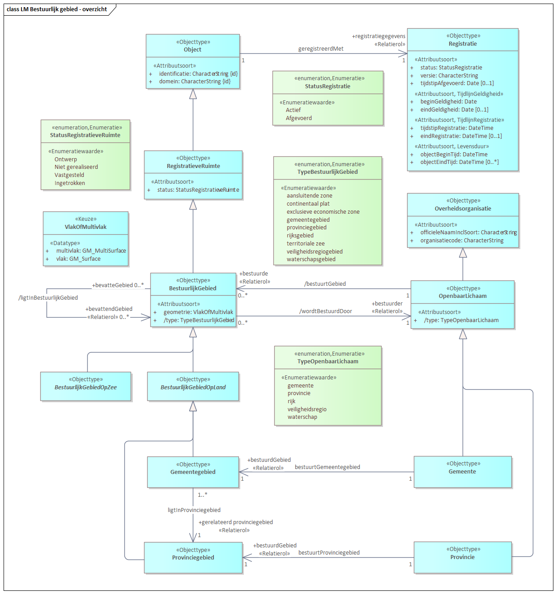

# Logisch Gegevensmodel v1.0.0

In Scope:
* Gemeente / Gemeentegebied
* Provincie / Provinciegebied

Voor documentatie van de onderdelen kan [de catalogus van het CM](https://geonovum.github.io/disgeo-im/) geraagdpleegd worden.

Andere onderdelen:

* [Het Enterprise Architect xmi bestand](./xmi/model.xmi)
* [De MIM XML serialisatie](./mim/disgeo-mim.xml)
